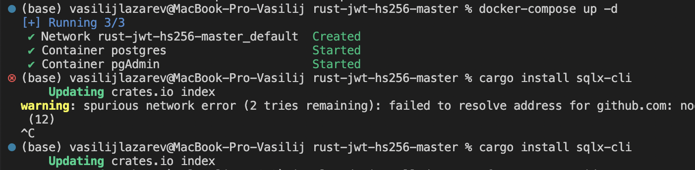
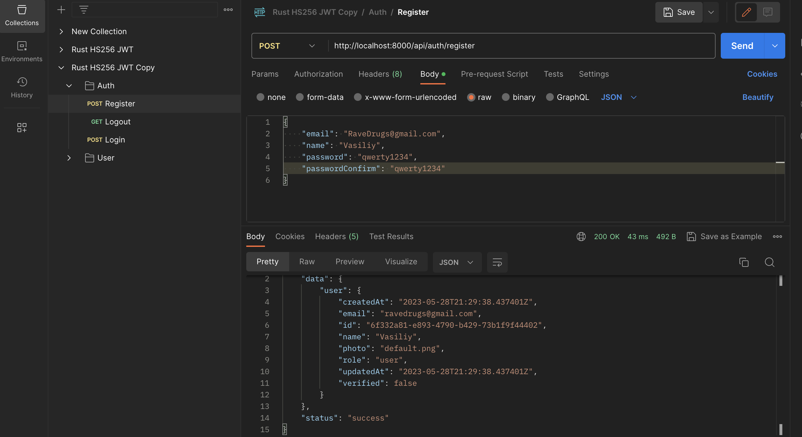
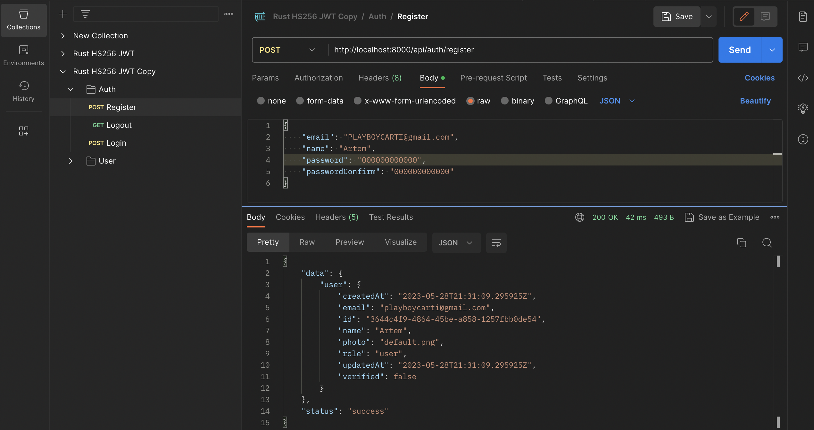
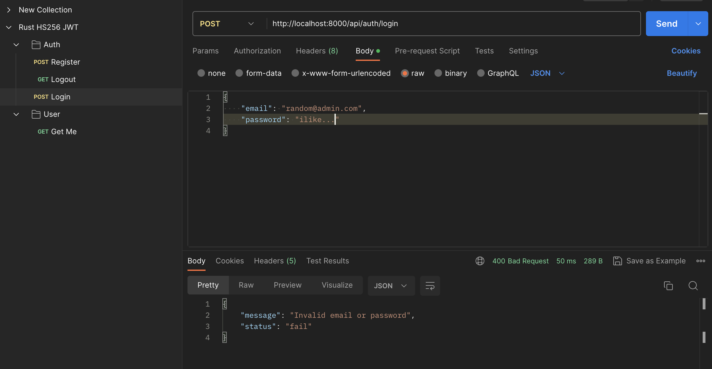
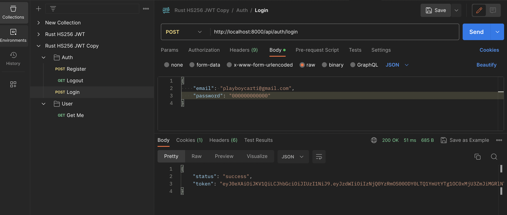
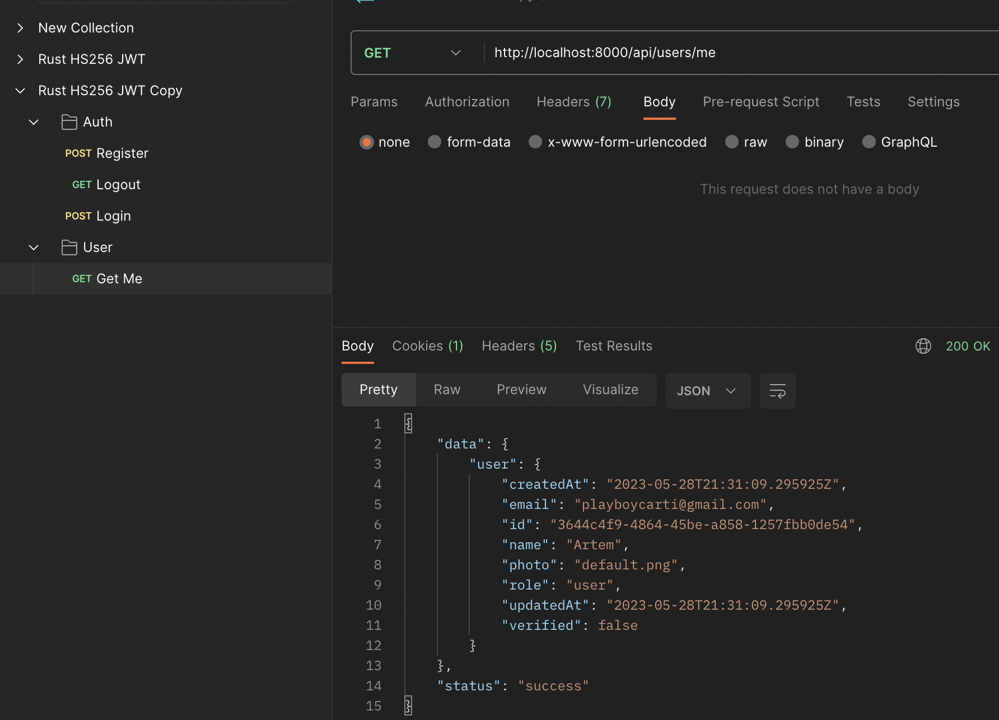
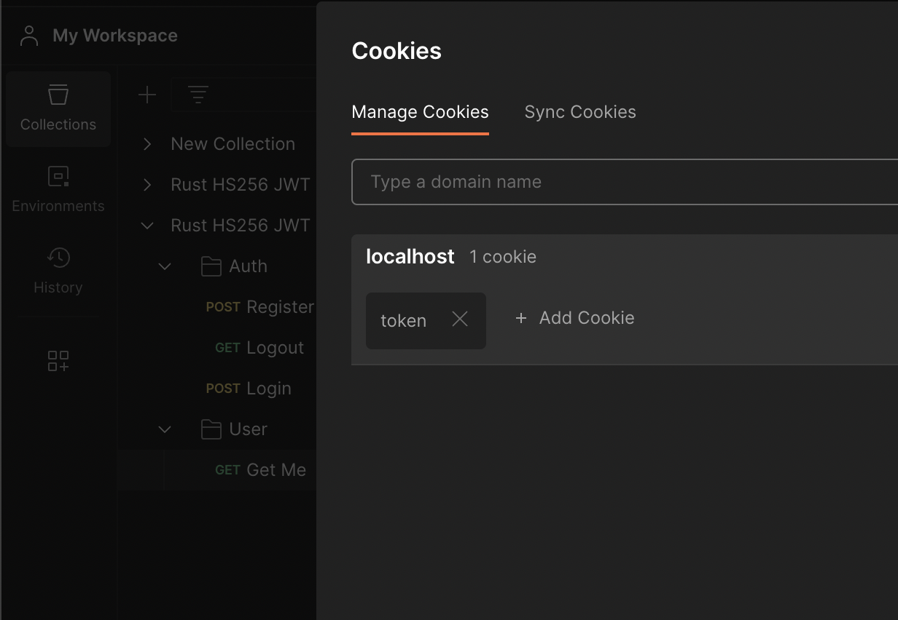
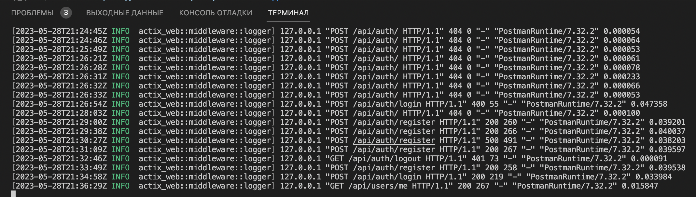

# JWT authentication microservice on the actix-web framework
Actix-web is a Rust web platform for creating scalable and incredibly fast web applications. It is built on top of the Actix framework, which is a Rust actors platform offering a simple and efficient concurrency control solution.

Actix-web comes with many features needed for web development, including routing, middleware, JSON serialization, asynchronous I/O, WebSockets, and more.

In this article, we will delve into the implementation of JWT authentication in Rust, covering all crucial steps from generating and verifying JWT tokens with the HS256 algorithm, to registering users, signing them in, logging them out, and safeguarding private routes.

## Topics Covered

- Run the Actix-Web JWT Project Locally
- Setup the Rust Project
- Setup Postgres and pgAdmin with Docker
- Load the Environment Variables
- Create the SQL Queries and Run the Migrations
- Create the Database Model
- Create the Response Structs
- Create the JWT Actix-Web Middleware Guard
- Implement the JWT Authentication Flow
    - Register User Route Handler
    - Login User Route Handler
    - Logout User Route Handler
    - Get Authenticated User Route Handler
    - Merge the Route Handlers
- Register the Routes Config and Add CORS
- Test the JWT Authentication Flow
    - Create a New User
    - Sign-in User
    - Access Protected Route
    - Logout User

## Install and Run:
### Start the PostgreSQL server in the Docker container by running the command in the root directory terminal:
```
docker-compose up -d
```
### a successful installation looks something like this

 

### To install the SQL CLI tool, run:
```
cargo install sqlx-cli
```
### apply the following command for migrations:
```
sqlx migrate run
```
### To install the necessary mailboxes and start the service, do:
```
cargo run -r
```

### I specifically left the .env file to make it easier for you to run :)


Чto test the Actix-Web JWT authentication flow, import the file [Rust-HS256-JWT.postman_collection.json](/Rust-HS256-JWT.postman_collection.json) in Postman (or expansion Thunder in VSC)


# TESTING:
## • user registration
 


## • check incorrect login with fake data


## • check login with correct data and get token


## • get user with token in cookie 



### if you really want to, you can add a token to the request:)


### Logger in console
 
